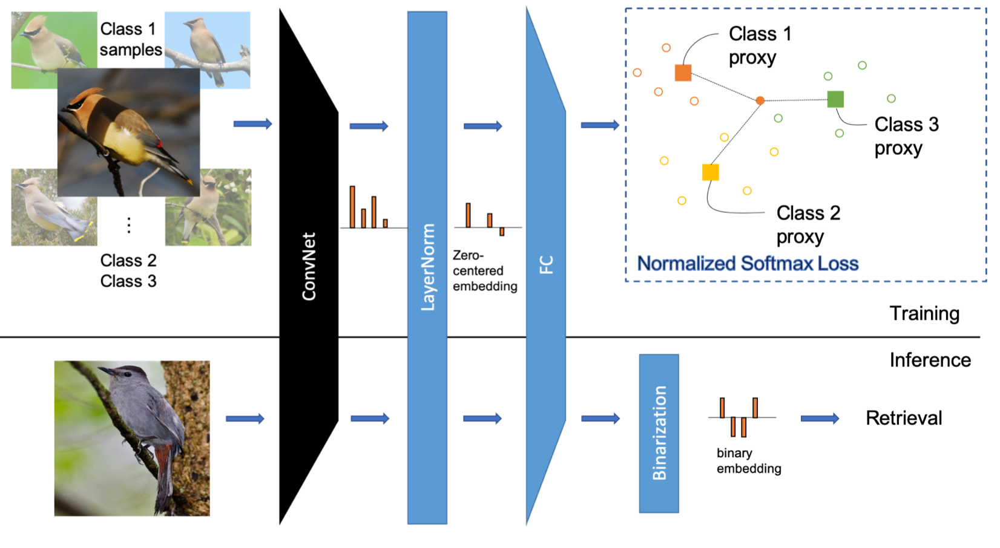
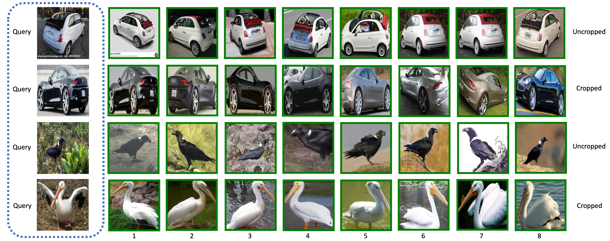
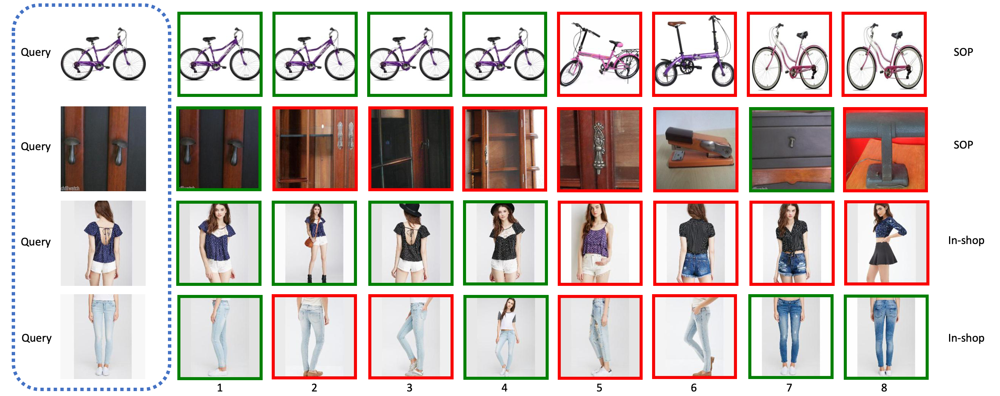

# NormSoftmax
A PyTorch implementation of NormSoftmax based on BMVC 2019 paper [Classification is a Strong Baseline for Deep Metric Learning](https://arxiv.org/abs/1811.12649).



## Requirements
- [Anaconda](https://www.anaconda.com/download/)
- [PyTorch](https://pytorch.org)
```
conda install pytorch torchvision cudatoolkit=10.0 -c pytorch
```
- thop
```
pip install thop
```

## Datasets
[CARS196](http://ai.stanford.edu/~jkrause/cars/car_dataset.html), [CUB200-2011](http://www.vision.caltech.edu/visipedia/CUB-200-2011.html), 
[Standard Online Products](http://cvgl.stanford.edu/projects/lifted_struct/) and 
[In-shop Clothes](http://mmlab.ie.cuhk.edu.hk/projects/DeepFashion/InShopRetrieval.html) are used in this repo.

You should download these datasets by yourself, and extract them into `${data_path}` directory, make sure the dir names are 
`car`, `cub`, `sop` and `isc`. Then run `data_utils.py` to preprocess them.

## Usage
### Train Model
```
python train.py --feature_dim 1024
optional arguments:
--data_path                   datasets path [default value is '/home/data']
--data_name                   dataset name [default value is 'car'](choices=['car', 'cub', 'sop', 'isc'])
--crop_type                   crop data or not, it only works for car or cub dataset [default value is 'uncropped'](choices=['uncropped', 'cropped'])
--lr                          learning rate [default value is 0.01]
--feature_dim                 feature dim [default value is 2048]
--temperature                 temperature used in softmax [default value is 0.05]
--recalls                     selected recall [default value is '1,2,4,8']
--batch_size                  train batch size [default value is 75]
--num_sample                  samples within each class [default value is 25]
--num_epochs                  train epoch number [default value is 30]
```

### Test Model
```
python test.py --retrieval_num 10
optional arguments:
--query_img_name              query image name [default value is '/home/data/car/uncropped/008055.jpg']
--data_base                   queried database [default value is 'car_uncropped_2048_data_base.pth']
--retrieval_num               retrieval number [default value is 8]
```

## Benchmarks
The models are trained on one NVIDIA Tesla V100 (32G) GPU, all the hyper-parameters are same with the paper.

### Model Parameters and FLOPs (Params | FLOPs)
<table>
  <thead>
    <tr>
      <th>Backbone</th>
      <th>CARS196</th>
      <th>CUB200</th>
      <th>SOP</th>
      <th>In-shop</th>
    </tr>
  </thead>
  <tbody>
    <tr>
      <td align="center">ResNet50</td>
      <td align="center">27.91M | 4.12G</td>
      <td align="center">27.91M | 4.12G</td>
      <td align="center">50.88M | 4.12G</td>
      <td align="center">35.89M | 4.12G</td>
    </tr>
  </tbody>
</table>

### CARS196 (Uncropped | Cropped)
<table>
  <thead>
    <tr>
      <th>Feature Type</th>
      <th>R@1</th>
      <th>R@2</th>
      <th>R@4</th>
      <th>R@8</th>
      <th>Download Link</th>
    </tr>
  </thead>
  <tbody>
    <tr>
      <td align="center">Dense</td>
      <td align="center">86.1% | 91.4%</td>
      <td align="center">91.9% | 95.0%</td>
      <td align="center">95.4% | 97.1%</td>
      <td align="center">97.4% | 98.3%</td>
      <td align="center"><a href="https://pan.baidu.com/s/1Wld7E02CaRgaZi4cv4I7dQ">gcmw</a> | <a href="https://pan.baidu.com/s/15jsM45iZY-u08Y39VkmRSQ">fygj</a></td>
    </tr>
    <tr>
      <td align="center">Binary</td>
      <td align="center">85.2% | 90.6%</td>
      <td align="center">91.6% | 94.6%</td>
      <td align="center">95.2% | 96.9%</td>
      <td align="center">97.3% | 98.2%</td>
      <td align="center"><a href="https://pan.baidu.com/s/1Wld7E02CaRgaZi4cv4I7dQ">gcmw</a> | <a href="https://pan.baidu.com/s/15jsM45iZY-u08Y39VkmRSQ">fygj</a></td>
    </tr>
  </tbody>
</table>

### CUB200 (Uncropped | Cropped)
<table>
  <thead>
    <tr>
      <th>Feature Type</th>
      <th>R@1</th>
      <th>R@2</th>
      <th>R@4</th>
      <th>R@8</th>
      <th>Download Link</th>
    </tr>
  </thead>
  <tbody>
    <tr>
      <td align="center">Dense</td>
      <td align="center">64.1% | 68.4%</td>
      <td align="center">75.4% | 79.9%</td>
      <td align="center">83.6% | 87.6%</td>
      <td align="center">90.6% | 92.9%</td>
      <td align="center"><a href="https://pan.baidu.com/s/19Hmibn-RbxAUTnOEPxxafw">qkjs</a> | <a href="https://pan.baidu.com/s/101_f16MD7y2cLuC6RRpJBA">h37y</a></td>
    </tr>
    <tr>
      <td align="center">Binary</td>
      <td align="center">62.7% | 66.8%</td>
      <td align="center">74.4% | 78.7%</td>
      <td align="center">82.8% | 87.2%</td>
      <td align="center">90.0% | 92.7%</td>
      <td align="center"><a href="https://pan.baidu.com/s/19Hmibn-RbxAUTnOEPxxafw">qkjs</a> | <a href="https://pan.baidu.com/s/101_f16MD7y2cLuC6RRpJBA">h37y</a></td>
    </tr>
  </tbody>
</table>

### SOP
<table>
  <thead>
    <tr>
      <th>Feature Type</th>
      <th>R@1</th>
      <th>R@10</th>
      <th>R@100</th>
      <th>R@1000</th>
      <th>Download Link</th>
    </tr>
  </thead>
  <tbody>
    <tr>
      <td align="center">Dense</td>
      <td align="center">78.7%</td>
      <td align="center">91.1%</td>
      <td align="center">96.5%</td>
      <td align="center">98.9%</td>
      <td align="center"><a href="https://pan.baidu.com/s/1izrEJUTHgB7Yafa6d938MA">3qr7</a></td>
    </tr>
    <tr>
      <td align="center">Binary</td>
      <td align="center">77.8%</td>
      <td align="center">90.7%</td>
      <td align="center">96.3%</td>
      <td align="center">98.8%</td>
      <td align="center"><a href="https://pan.baidu.com/s/1izrEJUTHgB7Yafa6d938MA">3qr7</a></td>
    </tr>
  </tbody>
</table>

### In-shop
<table>
  <thead>
    <tr>
      <th>Feature Type</th>
      <th>R@1</th>
      <th>R@10</th>
      <th>R@20</th>
      <th>R@30</th>
      <th>R@40</th>
      <th>R@50</th>
      <th>Download Link</th>
    </tr>
  </thead>
  <tbody>
    <tr>
      <td align="center">Dense</td>
      <td align="center">88.4%</td>
      <td align="center">97.5%</td>
      <td align="center">98.3%</td>
      <td align="center">98.7%</td>
      <td align="center">98.9%</td>
      <td align="center">99.0%</td>
      <td align="center"><a href="https://pan.baidu.com/s/1MW1Snt079y0wtPMA3Eeyhg">5wja</a></td>
    </tr>
    <tr>
      <td align="center">Binary</td>
      <td align="center">87.6%</td>
      <td align="center">97.4%</td>
      <td align="center">98.3%</td>
      <td align="center">98.6%</td>
      <td align="center">98.7%</td>
      <td align="center">98.9%</td>
      <td align="center"><a href="https://pan.baidu.com/s/1MW1Snt079y0wtPMA3Eeyhg">5wja</a></td>
    </tr>
  </tbody>
</table>

## Results

### CAR/CUB (Uncropped | Cropped)



### SOP/ISC

